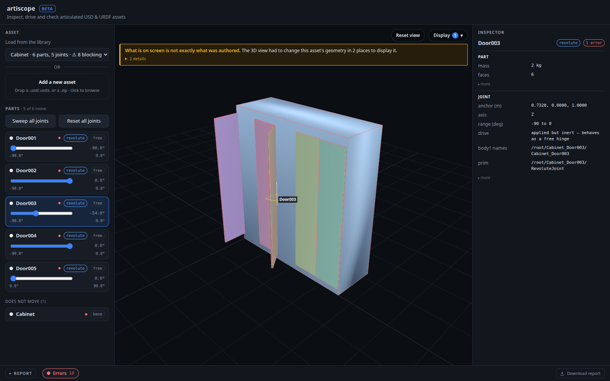

# artiscope

**Open an articulated 3D asset in your browser. Inspect every joint, drag it to
its stop, and see engine-correctness verdicts pinned on the part they concern.**

No GPU. No Isaac Sim. No Omniverse Kit boot. `pip install`, then under a second
per asset.



Somebody hands you an articulated USD or URDF asset. What is it? How many moving
pieces, hinged where, swinging how far — and what does the file actually *say*
about them? That question currently costs an Isaac Sim install and a GPU. It
should cost a browser tab.

```bash
git clone https://github.com/helincao618/artiscope && cd artiscope
python3 -m venv .venv && ./.venv/bin/pip install -r requirements.txt
./.venv/bin/python -m uvicorn app.main:app --port 8099
```

Open <http://127.0.0.1:8099/>. Five example assets are already there, so there is
nothing to download and nothing to configure before you can see what this does.
Point it at your own with `ARTISCOPE_ASSET_DIR=/path/to/delivery`.

## What you get

- **Every part, individually.** One named, individually coloured node per rigid
  body, in stage coordinates — plus a textured counterpart built from the asset's
  own materials that a toggle swaps to instantly.
- **Every joint, driveable.** Click a part, read its joint, drag it until it hits
  its authored stop. Or hit **Sweep all joints** and watch the whole asset move at
  once — a door hinged on the wrong edge, a drawer sliding into its carcass or an
  axis 90° off all look perfectly fine at rest and are unmissable in motion.
- **What the file states, per dimension.** Travel stops, zero pose, pivot
  placement, mass, drives, body attachment — each reported as `authored`,
  `absent`, `unusual` or `inconsistent`. Only the last is a judgement, and only
  because the data contradicts itself.
- **Engine verdicts, on the part they concern.** NVIDIA's Omni Asset Validator
  runs over the whole stage, and every finding is mapped back onto the specific
  part or joint it is about. Faulty parts are lit red in 3D.
- **A portability check**, which asks what the validator cannot: not "does every
  reference resolve" but "does this folder still work somewhere else".
- **Screenshot modes worth knowing.** Joint labels in 3D turn a viewport
  screenshot into a diagram. Swept volume draws ghosts of a part across its range
  — how much room a door needs, in one still image. Exploded view is the plainest
  possible statement of "this is several rigid bodies".
  `python -m tools.shots` writes all of them to PNG.

Nothing is ever written back to the asset. This tool is strictly read-only.

## USD is the deep path; URDF is a courtesy

| | USD | URDF |
|---|---|---|
| Read, view, drive the joints | yes | yes |
| Describe what the file states | yes | yes |
| Engine-correctness verdict | yes | **no** |
| Portability check | yes | yes |
| Export | never | never |

A URDF gets no engine verdict because NVIDIA's rules read `UsdPhysics`, and a
URDF has none. Rules that did not run say so as a finding of their own, rather
than leaving an empty rejection list to be read as a clean bill of health.

## Who decides what is correct

Not this tool. Engine-correctness rules come from NVIDIA's [Omni Asset
Validator](https://docs.omniverse.nvidia.com/kit/docs/asset-validator), which
knows what PhysX requires of USD and tracks it as the engine moves. What
artiscope adds is the half the validator does not do: **putting the verdict back
onto the part it is about.**

The difference is not cosmetic. Told that five prim paths violate a joint rule,
you still do not know which doors are broken. The `Cabinet` example reads as the
cleanest asset in the set — every joint limited, every mass authored — while all
five of its hinges point at a prim carrying no `RigidBodyAPI`, one level below
the one that has it. In a physics engine those doors do not open.

The validator is an optional dependency. Without it the viewer works and says so,
rather than pretending the asset passed. Reasoning in
[`DIRECTION.md`](DIRECTION.md).

## What this deliberately does not do

**It does not decide whether an asset is good enough.** There is no agreed
definition of a good articulated asset, and encoding a guess would freeze one
before anyone has looked at enough deliveries to have an opinion. So there is no
pass/fail, no score and nothing to sign — just a list of dimensions an
articulated asset can vary along, and what this particular file says on each.

Read one asset and you know what you were handed. Read a dozen and the pattern in
what is routinely missing is the raw material for the audit framework that does
not exist yet.

**There is no physics engine.** A revolute or prismatic joint has one degree of
freedom, so honouring its limits is a clamp on a scalar — and everything this
tool is for (is the hinge on the right edge, is the axis pointing the right way,
does the door swing 90° or 270°) is answered by kinematics alone.

The cost is real and worth stating: **this tool does not see collisions.** Drive a
dishwasher's baskets out with its door shut and they slide straight through it.
Full list in [`docs/known-limits.md`](docs/known-limits.md).

**Joint coverage is still growing.** Only revolute and prismatic joints are
interactive; `FixedJoint` is handled as structure. Spherical, `D6` and anything
else the reader does not recognise are **announced** — in the manifest warnings
and in a banner over the viewport — rather than dropped in silence.

That last rule is the one this codebase will not bend. A parser that cannot say
"I did not read this" makes absent and unread look identical, and then the tool
manufactures defects that were never in the asset. Most of the bugs in
[the trap catalogue](docs/usd-articulation-traps.md) are exactly that mistake
wearing a different costume.

## Example assets

Five hand-authored USDA assets ship in [`examples/`](examples), a few hundred
readable lines each. Four carry a specific, documented defect; the fifth is
clean, so that a clean bill of health means something. Two of the four are
confirmed broken by NVIDIA's validator independently of this repo's own reader.
See [`examples/README.md`](examples/README.md).

## Tests

```bash
./.venv/bin/pip install -r requirements-dev.txt
./.venv/bin/python -m pytest tests/
```

They run on a fresh checkout with nothing to download, because the assets they
assert against are the ones in `examples/`. `tests/test_ui.py` drives the actual
page in Chrome — the viewer is most of this tool, and a suite that stopped at the
Python would be testing the easy half. Those skip cleanly without a browser.

To run the structural assertions against a corpus of your own, set
`ARTISCOPE_FIXTURE_DIR`.

## Documentation

- [**Fifteen things USD articulation will do to you**](docs/usd-articulation-traps.md)
  — the trap catalogue. Worth reading even if you never run the tool.
- [`DIRECTION.md`](DIRECTION.md) — which half of the problem this repo owns, and
  why the correctness rules are NVIDIA's rather than its own.
- [`FINDINGS.md`](FINDINGS.md) — how six independent checks become one report,
  ordered by what kind of statement each is.
- [`docs/known-limits.md`](docs/known-limits.md) — what it does not do, including
  what was checked and found already correct.
- [`examples/README.md`](examples/README.md) — what each example asset is
  deliberately doing wrong.

## License

MIT — see [LICENSE](LICENSE). Third-party components and their licenses are
inventoried in [NOTICE](NOTICE).
